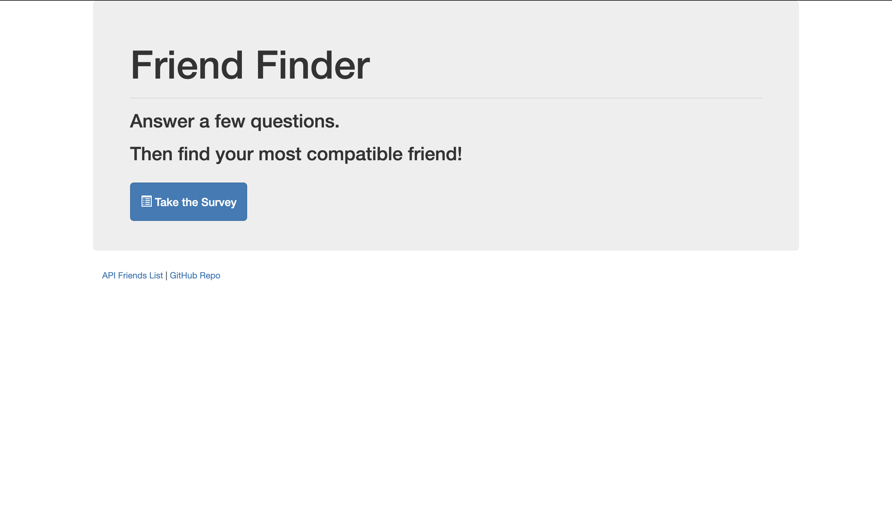
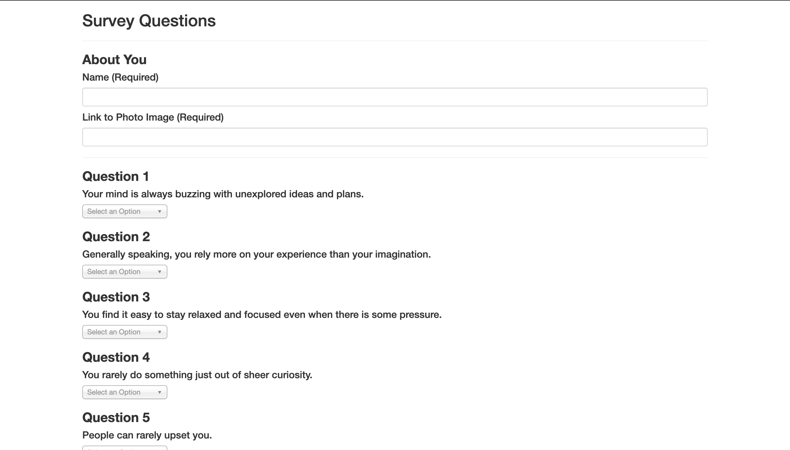
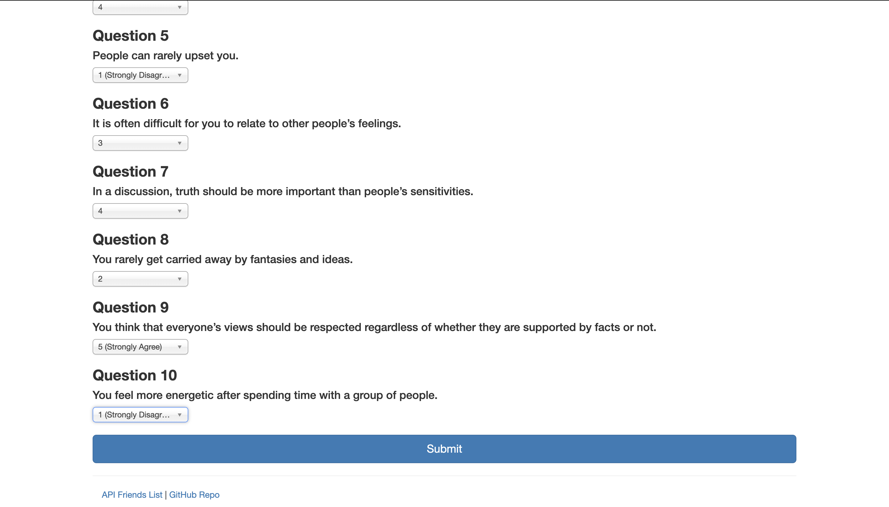
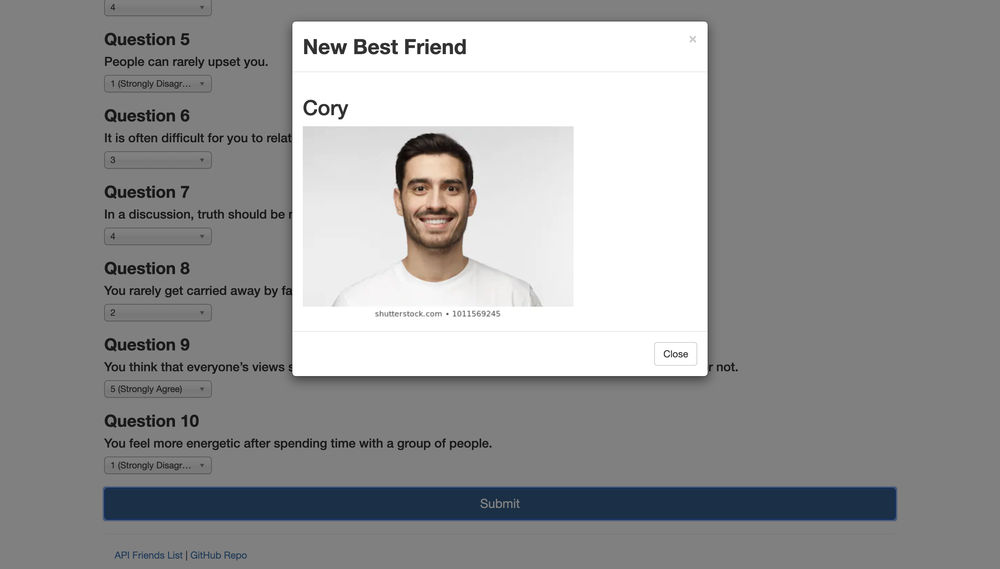

# FriendFinder
Web application to find friends

 

FriendFinder is an application that finds the user's most compatible friend for users based on a personality assessment. Users first complete a 10 question survey where the are given a scenario, and they choose on a scale from one to five whether or not they agree with the scenario.
 
 

  

Once the survey is complete and the user clicks submit, their score is totaled up and matched with the friend stored in data that has the least amount of difference between total scores. This is done through an AJAX post api call where the users data that was input from the survey is sent as an object, and we're returned with the most compatible friend displayed on a modal.

# View Deployment:
https://friendfindertb.herokuapp.com/

# Built With
Node.js  
Express.js  
Heroku for application deployment  
JavaScript  
Bootstrap CSS Framework  
jQuery  
HTML  
# Authors
Tony Bee

